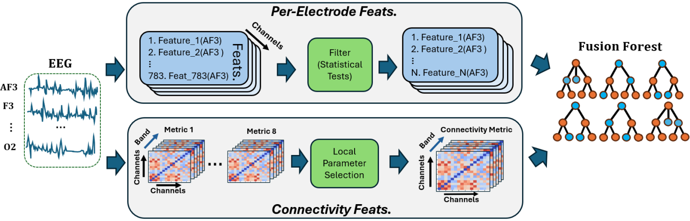

# KnowEEG: Explainable Knowledge Driven EEG Classification 🧠

[](https://opensource.org/licenses/MIT)
[](https://www.python.org/downloads/)

This repository contains the official implementation for the paper **"KnowEEG: Explainable Knowledge Driven EEG Classification"**. KnowEEG is a novel, feature-based machine learning pipeline that achieves state-of-the-art performance on EEG classification tasks while providing full model explainability.

Unlike opaque deep learning models, KnowEEG uses interpretable features and a modified Random Forest model (Fusion Forest) to not only make accurate predictions but also to discover verifiable neuroscientific knowledge. This implementation allows you to replicate our results and apply the KnowEEG pipeline to your own EEG datasets.

---

## ✨ Key Features

* **High Performance:** Achieves performance comparable to or exceeding state-of-the-art deep learning models across five different EEG classification tasks.
* **Full Explainability:** Uses inherently understandable features and a tree-based model to provide feature importance scores, allowing for knowledge discovery directly from the model.
* **No GPU Required:** The entire pipeline, from feature extraction to model training, runs efficiently on CPUs making it accessible.
* **Comprehensive Feature Engineering:** Generates a rich feature set by combining 783 per-electrode statistics with various between-electrode connectivity measures.

---

## ⚙️ The KnowEEG Pipeline

The KnowEEG pipeline consists of two parallel threads that process EEG data to generate features for our custom `Fusion Forest` model. 


*A diagram of the KnowEEG pipeline, as shown in our [paper](https://arxiv.org/abs/2505.00541)*

1.  **Per-Electrode Features Thread:** For each EEG electrode, 783 features from generalized time-series and EEG-specific domains are calculated. These features are then filtered using statistical tests (e.g., Kolmogorov-Smirnov test) to select only the most informative ones.

2.  **Connectivity Features Thread:** Between-electrode connectivity features are calculated using eight different metrics (e.g., Coherence, Phase Lag Index, Correlation) across six frequency bands (delta, theta, alpha, etc.). The best performing connectivity metric for the specific task is selected automatically via a local parameter selection process.

3.  **Fusion Forest Model:** The filtered per-electrode features and the selected connectivity features are fed into the **Fusion Forest**. This is our proposed modification to the standard Random Forest algorithm, which ensures that each decision tree is built using a random subset of features from *both* threads, preventing feature-mode bias and improving performance.


---

## Setup
This code has been tested with 'Python 3.1.0'. 
To get started create an environment using the command:
```
pip install -r requirements.txt
```
Next, Clone this repository and follow the full instructions for running the code below.

---
## Running the code

Your data should be stored in the Data/ folder in .npy file format as per the test data 'EEG_toy_data.npz'. You can begin by running the code with this test data and subsequently replace with your own real EEG data.
<br>
<br>
Follow the steps below to run the pipeline with the toy EEG data:

1. Within the folder 'Feature_Generation_Scripts' run the python script 'Main_Script_Generate_All_Feats.py'. This will use subscripts to generate all statistical features and connectivity features saving them in the Data/All_Features/ folder.

2. Within the folder Data/Filtered_Features/ run the python script 'Run_train_test_split_and_filtering.py'. This will use subscripts to train-test split the EEG data, filter the TSFresh features and select the best performing connectivity metric (local parameter selection for use in the final model).

3. Run the final model from the folder 'Final_Model/'. We have two example notebooks, one that uses the standard Random Forest model and another that uses our Fusion Forest. 

Note : for the toy data none of the statistical features are significant for classification hence there are only connectivity features.


---

## 📂 Repository Structure

<pre>
KnowEEGRepo/
│
├── Data/
│   ├── All_Features/             # Raw calculated features (connectivity and tsfresh .pkl files)
│   ├── Filtered_features/        # Scripts and outputs for feature filtering and data splitting
│   │   ├── Run_train_test_split_and_filtering.py  # Main script for this step
│   │   └── ...
│   └── EEG_toy_data.npz          # Toy processed EEG data to test the pipeline
│
├── Feature_Generation_Scripts/
│   └── Main_Script_Generate_All_Feats.py  # Main script to generate all features from raw EEG
│
└── Final Model/
    ├── Train_Model_Fusion_Forest.ipynb  # Jupyter Notebook to train the final Fusion Forest model
    ├── Fusion_Forest_Functions.py       # Helper functions for the Fusion Forest model
    └── Train_Model_RF.ipynb             # Jupyter Notebook to train final Random Forest Model (Alternative to Fusion Forest)
    <pre>

---

## 📜 Citation


```
@misc{sahota2025knoweegexplainableknowledgedriven,
      title={KnowEEG: Explainable Knowledge Driven EEG Classification}, 
      author={Amarpal Sahota and Navid Mohammadi Foumani and Raul Santos-Rodriguez and Zahraa S. Abdallah},
      year={2025},
      eprint={2505.00541},
      archivePrefix={arXiv},
      primaryClass={cs.LG},
      url={https://arxiv.org/abs/2505.00541}, 
}```

